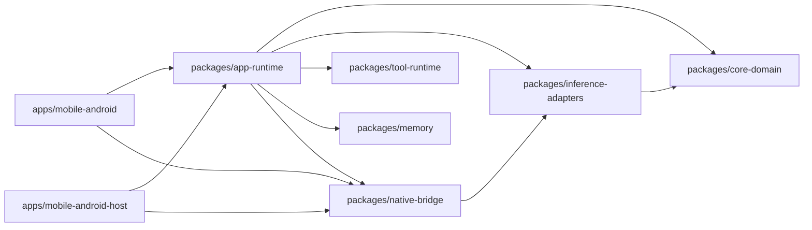
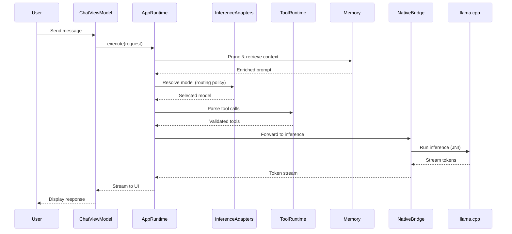

# PocketAgent

Offline, privacy-first AI assistant for Android — runs large language models directly on your phone.

Source of truth:
- Runnable commands live in `scripts/dev/README.md`.
- Documentation front door lives in `docs/start-here/README.md`.
- Current launch scope, claim boundaries, and readiness order live in `docs/operations/play-store-launch-program.md` and `docs/operations/tickets/prod-10-launch-gate-matrix.md`.
- Current release posture and blocker chain live in `docs/roadmap/current-release-plan.md` and `docs/operations/execution-board.md`.

## Features

- **Offline-first inference** — chat generation runs locally; model discovery and downloads may use the network
- **Streaming responses** — real-time token-by-token display
- **Model routing** — automatic model selection based on device state
- **Performance profiles** — BALANCED / FAST / BATTERY modes
- **GPU acceleration** — OpenCL/Hexagon backend support
- **Prompt-first local tools** — validated local tool flows entered from prompt shortcuts
- **Memory** — persistent context across sessions
- **Single-image Q&A** — one attached image can stay in the same chat thread
- **Voice** — editable local English dictation, read-aloud through an installed Android voice reported as offline-capable, opt-in hands-free “Offas” activation, and confirmed alarms, timers, app launch, media volume, and flashlight actions

Voice is available to normal users in production builds from `Advanced` settings;
it is not debug-only or device-allowlisted. The frozen Play Store headline claim
set remains bounded to core chat, prompt-first local tools, and single-image
Q&A until retained 24-hour and multi-OEM evidence supports broader hands-free
reliability and battery promises.

Current controlled-MVP claim surface:

- offline local chat
- prompt-first local tools
- single-image Q&A
- privacy-first local behavior

Anything broader than that should be treated as implementation detail until the launch canon and current-window evidence say otherwise.

## Tech Stack

| Layer | Technology |
|-------|------------|
| UI | Jetpack Compose, Kotlin |
| Runtime | llama.cpp (JNI) |
| Architecture | Modular monolith (KMP) |
| Testing | Maestro, JUnit, Kotest |

## Supported Models

- Qwen3 0.6B
- Qwen 3.5 0.8B
- Qwen3 1.7B
- Llama 3.2 1B

## Quick Start

**Requirements:** Android SDK 34+, Kotlin 1.9+, JDK 17+

Start from the canonical command guide in [scripts/dev/README.md](scripts/dev/README.md) for the current fast-test, build, device-lane, and release-readiness commands.

## Architecture

### Module Dependency Graph

### Request Flow

When a user sends a message:

### Key Responsibilities

| Module | Responsibility |
|--------|----------------|
| `core-domain` | Domain models, interfaces, contracts |
| `inference-adapters` | Model selection policy, runtime abstraction |
| `tool-runtime` | Tool schema validation, execution |
| `memory` | Context pruning, retrieval, persistence |
| `native-bridge` | JNI bindings to llama.cpp |
| `app-runtime` | Orchestration, startup guards, benchmarks |
| `mobile-android` | Compose UI, ViewModels, Android integration |

## Directory Layout

| Path | Purpose |
|------|---------|
| `apps/mobile-android/` | Android app module |
| `apps/mobile-android-host/` | Host/JVM smoke tests |
| `packages/app-runtime/` | Orchestration layer |
| `packages/native-bridge/` | JNI + llama.cpp runtime |
| `packages/core-domain/` | Shared domain contracts |
| `packages/tool-runtime/` | Local tool execution |
| `packages/memory/` | Memory & retrieval |
| `scripts/dev/` | Dev/test entrypoints |
| `tests/maestro/` | E2E mobile flows |

## Contributing

Contributions are welcome. Use the canonical workflow in [scripts/dev/README.md](scripts/dev/README.md) for the current fast, merge, lane, and governance checks before opening a PR.

For detailed documentation, see [`docs/`](docs/).
